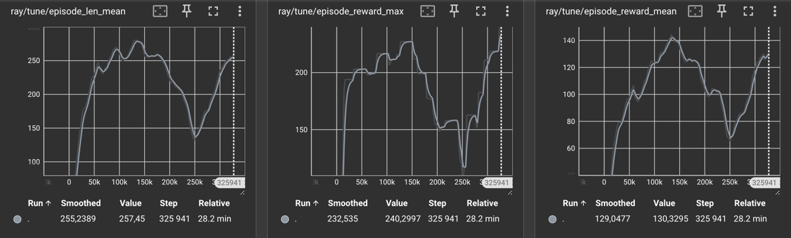

# Simple Report on CartPoleLeftRightEnv

> <picture>
>   <source media="(prefers-color-scheme: light)" srcset="https://raw.githubusercontent.com/Mqxx/GitHub-Markdown/main/blockquotes/badge/light-theme/issue.svg">
>   
> </picture><br>
>
> **Issue**
>
>  The task is called **CartPole Left Right**. You need to change classic CartPole environment in such > a way that it will have a goal (0 or 1) and Cart should balance the Pole in correspond sides of > platform `(0 - left, 1 - right)`. The goal implementation is already provided for you. The main goal is > to implement reward function that will helps agent to do this.
>
> - implement reward function in CartPoleEnv script in such a way that your Cart will balance Pole on specific side of platform depending on the goal.
> - train it with RLLib (template is given) getting the resulut from tensorboard (generated by RLLib) and video with your result.

## Reward functions design
```py
# reward_based is based on distance to goal , give different reward from 0 to 1
def reward_based(goal, x, threshold):
    if goal == 0:
        return 1 - (abs(-threshold-x) / (threshold * 2))

    return 1 - (abs(threshold-x) / (threshold * 2))

def reward_smooth(goal, x, threshold): # x -> cart_pos
    if abs(x) > threshold:
        return 0

    if goal == 1.0:
        return np.exp(x - 2.4)

    return np.exp(-x - 2.4)
```

## Punishment design
```python
class CartPoleLeftRightEnv(CartPoleEnv):
    ...
    # Based on distance to goal and angle to 0, 
    # give different punishment from -1 to 0
    elif self.steps_beyond_done is None:
            # Pole just fell!
            self.steps_beyond_done = 0
            if time_done:
                reward = 0.0
            else:
                if goal == 0:
                    reward = (((-self.x_threshold - x) / (self.x_threshold * 2)) - (abs(theta) / self.theta_threshold_radians)) / 2
                else:
                    reward = (-((self.x_threshold - x) / (self.x_threshold * 2)) - (abs(theta) / self.theta_threshold_radians)) / 2
```

## Trial Status
|Trial name |	status	| loc	| iter |	total time (s)	|ts	| reward	|num_recreated_worker s	|episode_reward_max	| episode_reward_min|
|:-----:|:-----:|:-----:|:-----:|:-----:|:-----:|:-----:|:-----:|:-----:|:-----:|
|PPO_CartPoleLeftRightEnv_Based_46fd0_00000|	TERMINATED|	172.28.0.12:7238|	150	|1696.62	|325941|	130.33|	0|	240.3|	58.3104|
|PPO_CartPoleLeftRightEnv_Smooth_2b8e3_00000|	TERMINATED	|172.28.0.12:19644	|150	|1619.68	|325508|	40.9529	|0	|98.1327|	3.48517|

## Scores
> Training Based
> ```
> Score: 66.22232050844879
> Score: 125.56653915054318
> Score: 168.58133830838153
> Score: 168.0161733349891
> Score: 170.4323449005853
> Score: 119.41957842599925
> Score: 198.42397014602207
> Score: 122.25300951901097
> Score: 116.9139393166341
> Score: 128.13535426706278
> ```

> Training Smooth
> ```
> Score: 24.2498556931394
> Score: 24.00760687982738
> Score: 8.5703437373155
> Score: 28.958751135354422
> Score: 28.71613589740995
> Score: 30.10041175478626
> Score: 26.145781110803444
> Score: 27.85244156353257
> Score: 31.611921509556886
> Score: 6.558936680159203
> ```

## Vids

> <picture>
>   <source media="(prefers-color-scheme: light)" srcset="https://raw.githubusercontent.com/Mqxx/GitHub-Markdown/main/blockquotes/badge/light-theme/check.svg">
>   
> </picture><br>
>
> Training Based
> <video width="630" height="300" src="https://user-images.githubusercontent.com/ec_lab3_cartpole/results/training_based.mp4"></video>
>
> Training Smooth
> <video width="630" height="300" src="https://user-images.githubusercontent.com/ec_lab3_cartpole/results/training_smooth.mp4"></video>


## Graph from tensorboard
> Training Based



> Training Smooth

